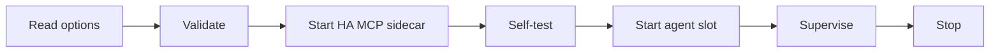

# VESTA Agent host — HA app specification

Version 1.1 · 28 September 2026
Read first: [`docs/agent-integration/PLAN.md`](../agent-integration/PLAN.md) (names, foundations F1–F10, links, VESTA Kiosk agent interface, Telegram switch-over).

## 1. Goal

Build a dedicated Home Assistant app, the **VESTA Agent host**, that will run the **VESTA Agent** (Claude Agent SDK, built by Fabien) on the HA Yellow.

The VESTA Agent itself is **out of scope**. The host is a portable shell with an empty **agent slot**. It ships with a **stub** that tests every link, so the real agent can be dropped in later without changing the host.

Out of scope: the VESTA Agent code, prompts, VESTA Skills content, autonomy rules, Telegram behaviour, Paperclip packaging (only the environment contract is shared with it).

## 2. Names specific to this document

| Name | Meaning |
|---|---|
| VESTA Agent host | This HA app. Slugs `vesta_agent` (stable) and `vesta_agent_dev` (development channel). |
| Agent slot | Folder and process where the VESTA Agent runs. Holds the stub until the agent is delivered. |
| Stub | Minimal program in the agent slot that runs the self-test and nothing else. |
| HA MCP sidecar | HA MCP server running inside the host, used only by the agent slot. |
| Environment contract | Fixed list of environment variables the host gives the agent slot (section 7). The only interface host → agent. |
| Agent manifest | `vesta-agent.yaml` shipped with the agent: how to install and start it (section 8). |

## 3. Design principles (non-negotiable)

- **H1 Portable shell.** The same image runs as an HA app or as a standalone container. Only the source of the options differs.
- **H2 Agent-agnostic.** The host knows the agent only through the manifest and the environment contract. No agent logic in the host.
- **H3 No local-only privileges.** `homeassistant_api: false`, `hassio_api: false`. Home Assistant is reached with the "VESTA Agent" user token, exactly as from outside (PLAN F10).
- **H4 Outbound only.** No published port, no ingress. The host calls Home Assistant, the VESTA Kiosk, Anthropic and (later) Telegram; nothing calls it.
- **H5 Telegram gated.** Until `telegram_takeover: true`, the bot token is never exported and no Telegram call is made. (`getUpdates` from the host would steal button presses from Home Assistant and break the facility-manager job flow.)
- **H6 Skills stay live.** VESTA Skills live in `/config/skills`, never in the image; editable without restart or rebuild.
- **H7 Never built on the Yellow.** Images are built by GitHub Actions and pulled from GHCR.
- **H8 Secrets stay secret.** Secrets exist only as `password` options or environment variables and are redacted in every log line.

## 4. Repository, branches and CI

Repository: `jim1982ha/villa-kiosk` (same store as the VESTA Kiosk). **Mirror the existing VESTA Kiosk patterns** — read before writing anything:

- `villa-kiosk/config.yaml` (image pull, `init: false`, s6-overlay from the HA base image),
- `.github/workflows/build.yaml` (gates first, per-arch images, per-branch image suffix, `:latest` only from `main`, `sync-dev2-manifest` job),
- `.github/workflows/ci.yaml`.

### 4.1 Layout
```
villa-kiosk/                        (existing — do not modify for this work)
villa-kiosk-dev2/                   (existing — do not modify)
vesta-agent/                        NEW  stable app manifest (on main)
  config.yaml  DOCS.md  CHANGELOG.md  icon.png  logo.png  translations/en.yaml
vesta-agent-dev/                    NEW  dev channel manifest (generated on main by CI)
agent-host/                         NEW  image source
  Dockerfile
  rootfs/etc/s6-overlay/s6-rc.d/{ha-mcp,agent}/
  rootfs/usr/bin/vesta-entrypoint
  rootfs/usr/bin/vesta-selftest
  stub/                             self-test agent + its vesta-agent.yaml
  tests/
  CLAUDE.md                         working rules for this folder
.github/workflows/agent-host.yaml   NEW
docs/agent-host/SPEC.md             this file
docs/agent-integration/PLAN.md
```

### 4.2 Branches
- Develop on branch **`agent-dev`**. Release by merging to `main`.
- The HA store reads manifests from `main` only. As for DEV2, a CI job on `agent-dev` copies `vesta-agent/` to `vesta-agent-dev/` on `main`, patching only name, slug, image and version. It never touches `vesta-agent/`, `villa-kiosk/` or `villa-kiosk-dev2/`.

### 4.3 Workflow `agent-host.yaml`
- Triggers: pushes to `main` and `agent-dev` touching `agent-host/**`, `vesta-agent/config.yaml` or the workflow itself; plus `workflow_dispatch`.
- **Must not overlap the VESTA Kiosk build**: never edit the root `Dockerfile`, `rootfs/**`, `src/**`, `package*.json`, `build.yaml` or `ci.yaml`.
- Jobs: tests (section 13) → build amd64 + aarch64 (QEMU + Buildx, actions pinned by SHA like `build.yaml`) → push → (on `agent-dev`) sync manifest.
- Image: `ghcr.io/jim1982ha/vesta-agent{suffix}-{arch}:{version}`, suffix empty on `main`, `-agent-dev` otherwise; `:latest` only from `main`. Report the image size in the job summary.
- **GHCR packages must be public**: the Supervisor pulls without credentials (same as the VESTA Kiosk images).
- Agent source: build arg `AGENT_REF` (git ref of Fabien's repository). Empty → stub only. If that repository is private, read it with a deploy key or fine-grained token stored as the secret `AGENT_REPO_TOKEN`; never print it.

### 4.4 Base image and runtimes
- `BUILD_FROM=ghcr.io/home-assistant/{arch}-base-debian:latest` (s6-overlay and bashio included). Debian, not Alpine: the Claude Agent SDK and its runtime need glibc.
- Install Python 3 and Node.js LTS so the agent can use either SDK flavour. Everything else comes from the agent manifest.
- Multi-stage build; no compilers in the final layer.

## 5. config.yaml (stable; the dev copy differs only in name, slug, image)

```yaml
name: "VESTA Agent"
version: "0.1.0"
slug: vesta_agent
description: "Host for the VESTA Agent (Claude Agent SDK)"
url: "https://github.com/jim1982ha/villa-kiosk"
arch: [aarch64, amd64]
image: "ghcr.io/jim1982ha/vesta-agent-{arch}"
init: false
startup: application
boot: auto
homeassistant_api: false
hassio_api: false
map:
  - addon_config:rw
timeout: 30
backup_exclude:
  - "*/cache/*"
options:
  agent_mode: stub
  ha_url: "http://homeassistant:8123"
  ha_mcp_mode: sidecar
  kiosk_url: "http://e66a2348-villa-kiosk:8099"
  telegram_takeover: false
  stub_heartbeat: false
  log_level: info
schema:
  agent_mode: list(stub|agent)
  anthropic_api_key: password?
  ha_url: url
  ha_token: password?
  ha_mcp_mode: list(sidecar|external)
  ha_mcp_url: url?
  ha_mcp_secret: password?
  kiosk_url: url
  kiosk_agent_token: password?
  telegram_takeover: bool
  telegram_bot_token: password?
  stub_heartbeat: bool
  log_level: list(debug|info|warning|error)
```
Dev channel default `kiosk_url`: `http://e66a2348-villa-kiosk-dev2:8099`.

## 6. Options

| Option | Default | Purpose |
|---|---|---|
| `agent_mode` | `stub` | What runs in the agent slot. |
| `anthropic_api_key` | empty | Anthropic Console key (required in `agent` mode). |
| `ha_url` | `http://homeassistant:8123` | Home Assistant as seen from the host. |
| `ha_token` | empty | Long-lived token of the "VESTA Agent" HA user (PLAN B3). |
| `ha_mcp_mode` | `sidecar` | HA MCP inside the host, or an existing endpoint. |
| `ha_mcp_url`, `ha_mcp_secret` | empty | External mode only. |
| `kiosk_url` | see above | VESTA Kiosk agent interface base address. |
| `kiosk_agent_token` | empty | Same value as `agent_token` in the VESTA Kiosk. |
| `telegram_takeover` | `false` | `true` only after the Telegram switch-over (PLAN section 8). |
| `telegram_bot_token` | empty | Exported only when `telegram_takeover` is true. |
| `stub_heartbeat` | `false` | Stub posts heartbeats to the VESTA Kiosk (end-to-end presence test). |
| `log_level` | `info` | Host and agent log level. |

Validation: in `agent` mode, a missing `anthropic_api_key` or `ha_token` stops the start with a clear message. In `stub` mode, missing values only skip the related checks.

## 7. Environment contract (host → agent slot)

The same names are used in every deployment (HA app, standalone Docker, Paperclip).

| Variable | Content |
|---|---|
| `ANTHROPIC_API_KEY` | from `anthropic_api_key` (standard name read by the Claude Agent SDK) |
| `VESTA_HA_URL`, `VESTA_HA_TOKEN` | Home Assistant address and VESTA Agent user token |
| `VESTA_HA_MCP_URL` | sidecar: `http://127.0.0.1:<port>/<path>`; external: `ha_mcp_url` |
| `VESTA_HA_MCP_SECRET` | external mode only, else empty |
| `VESTA_KIOSK_URL`, `VESTA_KIOSK_TOKEN` | VESTA Kiosk agent interface address and bearer token |
| `VESTA_CF_ACCESS_CLIENT_ID`, `VESTA_CF_ACCESS_CLIENT_SECRET` | empty on the Yellow; set when running remotely behind Cloudflare Access |
| `VESTA_TELEGRAM_ENABLED` | `true` / `false` |
| `VESTA_TELEGRAM_BOT_TOKEN` | present only when enabled |
| `VESTA_SKILLS_DIR` | `/config/skills` |
| `VESTA_AGENT_CONFIG_DIR` | `/config/agent` |
| `VESTA_DATA_DIR` | `/data/agent` |
| `VESTA_LOG_LEVEL`, `TZ` | log level; Home Assistant time zone |
| `VESTA_DEPLOYMENT`, `VESTA_INSTANCE` | `ha_app`/`standalone`; `dev`/`prod` |

## 8. Agent manifest (agent → host)

The VESTA Agent ships `vesta-agent.yaml` at the root of its folder. The stub ships the same file, so the host code path is identical.

```yaml
name: vesta-agent
version: "x.y.z"
runtime: python            # python | node
install: "pip install --no-cache-dir -r requirements.txt"   # run at image build
start: "python -m vesta_agent"
stop_grace_seconds: 20     # allowed time after SIGTERM
health:                    # optional
  command: "python -m vesta_agent.health"
```

Rules for the agent (the only requirements placed on Fabien's code):
1. Read configuration only from the environment contract.
2. Write only under `VESTA_DATA_DIR`; read VESTA Skills from `VESTA_SKILLS_DIR` and pick up changes without restart.
3. Log to stdout; never print secrets.
4. Stop cleanly within `stop_grace_seconds` after SIGTERM.
5. Never contact Telegram when `VESTA_TELEGRAM_ENABLED` is false.

## 9. File system layout

| Path | Owner | Persistence | Content |
|---|---|---|---|
| `/opt/vesta/agent` | image | replaced on update | agent code or stub, dependencies |
| `/opt/vesta/host` | image | replaced on update | entrypoint, self-test, s6 services |
| `/data/agent` | agent | kept, in backups | agent state |
| `/data/host` | host | kept, in backups | `selftest.json`, crash counter, last start info |
| `/config/skills` | people and agent | kept, in backups, editable from HA | VESTA Skills (one folder per skill) |
| `/config/agent` | people and agent | kept, in backups, editable from HA | agent-owned editable settings |
| `/data/options.json` | Supervisor | managed by HA | options (HA deployment only) |

First start creates `/config/skills` and `/config/agent` with a README each; never overwrites existing files.

## 10. Lifecycle


- Options: `/data/options.json` in HA; otherwise environment variables `VESTA_OPT_<OPTION_NAME_UPPER>` (standalone).
- Sidecar (sidecar mode only) must answer before the agent starts.
- Restart policy: s6 restarts a crashed service after 5 s, doubling up to 5 min. After 5 agent crashes within 10 min, stop restarting it, keep the container running, log the reason (heartbeats stop, so the VESTA Kiosk shows the agent offline).
- Stop: SIGTERM to the agent slot, wait `stop_grace_seconds`, then stop the sidecar; everything within `timeout: 30`.
- Start banner: host version, agent name/version (or `stub`), deployment, instance, mode of each link. Never a secret.

## 11. Self-test (stub mode, and at every start)

| Link | Check | Pass |
|---|---|---|
| Home Assistant | `GET {ha_url}/api/` with the token | HTTP 200 |
| HA MCP | MCP initialize, then list tools | ≥ 1 tool; server version logged |
| VESTA Kiosk | `GET {kiosk_url}/agent/v1/info` with the bearer token | HTTP 200, contract `1` |
| Anthropic | list models with the API key | HTTP 200 |
| Telegram | `getMe` only, and only if `telegram_takeover` is true | `ok: true`; never `getUpdates` |
| Presence (optional) | `POST {kiosk_url}/agent/v1/heartbeat` if `stub_heartbeat` | HTTP 200; the VESTA Kiosk shows the agent online |

- Each result is `pass`, `fail` or `skipped` (with the reason) — one log line per link, and `/data/host/selftest.json` with a timestamp.
- A missing credential or a missing remote interface = `skipped`, never `fail`.
- Stub mode never stops on a failed check. Agent mode delays the agent start while Home Assistant or Anthropic fail, retrying with backoff.

## 12. HA MCP sidecar, security, resources

**HA MCP sidecar**
- Same HA MCP server project as the development instance (the installed app `81f33d0f_ha_mcp`), pinned to one release in the Dockerfile; upgrades deliberate and listed in `CHANGELOG.md`.
- Bound to 127.0.0.1; authenticated to Home Assistant with the VESTA Agent token.
- External mode: no sidecar; the agent uses `ha_mcp_url`.

**Security**
- No published port, no ingress, no host network, not privileged, default AppArmor; `homeassistant_api` and `hassio_api` off.
- A redaction filter covers every secret option value in every log line (host, sidecar, agent output).
- The HA token's rights are decided in PLAN B3; the host assumes neither admin nor non-admin.

**Resources (HA Yellow)**
- Measure idle RAM of stub + sidecar and record it in `DOCS.md`. Keep ≥ 500 MB free on the Yellow once the VESTA Agent runs.
- Keep the image lean; CI reports its size. Disk on the Yellow must be freed before the first install (PLAN B6).

## 13. Standalone mode

```yaml
services:
  vesta-agent:
    image: ghcr.io/jim1982ha/vesta-agent-amd64:0.1.0
    restart: unless-stopped
    env_file: vesta-agent.env      # VESTA_OPT_* values, never committed
    volumes:
      - ./data:/data
      - ./config:/config
```
Remote deployments set the Cloudflare Access variables and use tunnel addresses. The self-test must pass the same way from outside the villa.

## 14. Verify — do not assume

Check each item against the real system or upstream documentation before using it, and record the answer in `DOCS.md`:

1. The HA MCP server project and release behind the installed app `81f33d0f_ha_mcp`, its launch command, transport and endpoint path.
2. The internal hostnames seen from another app: Home Assistant (`homeassistant:8123`), VESTA Kiosk stable and DEV2 (`e66a2348-villa-kiosk[-dev2]:8099`).
3. The current `map:` syntax for `addon_config` and the `schema` types used in section 5.
4. The exact tag of the HA Debian base image.
5. Whether the Claude Agent SDK (Python flavour) needs Node.js at runtime.
6. How the Supervisor passes the time zone to apps.

## 15. Dependencies (outside this work)

| Needed for | Comes from |
|---|---|
| Home Assistant and HA MCP checks passing | "VESTA Agent" HA user + token (PLAN B3) |
| HA MCP version to pin | PLAN B4 |
| VESTA Kiosk check and heartbeat passing | VESTA Kiosk agent interface v1 (PLAN workstream A) |
| Remote self-test | Cloudflare routes (PLAN section 7) |
| `telegram_takeover: true` | Telegram switch-over (PLAN section 8), go-live only |

The first delivery is **accepted with these checks reported as `skipped`**. Full acceptance follows once the dependencies exist.

## 16. Milestones (work in this order; stop and report after each)

| # | Milestone | Done when |
|---|---|---|
| M1 | Branch `agent-dev`, `agent-host/` skeleton, Dockerfile, `vesta-agent/config.yaml`, workflow building both architectures | CI publishes public images; the dev channel appears in the HA store; install on the Yellow pulls, never builds |
| M2 | Entrypoint: options (HA + standalone), validation, environment contract, file layout, redaction | Start banner correct; folders created without overwriting; no secret in logs |
| M3 | Stub + self-test | Every link reports pass / fail / skipped; `selftest.json` written |
| M4 | HA MCP sidecar (pinned) + external mode | MCP check passes with a VESTA Agent token; external mode skips the sidecar |
| M5 | Supervision and stop | Crashing stub: backoff, crash-loop stop; clean stop within 30 s |
| M6 | Standalone mode | Same image passes the self-test with `docker compose` outside HA |
| M7 | Tests, `DOCS.md`, `CHANGELOG.md`, section 14 answers recorded | All acceptance criteria below |

## 17. Acceptance criteria

| Area | Done when |
|---|---|
| Build | CI publishes aarch64 + amd64 public images; the app installs on the Yellow without building on it. |
| Isolation | No change under `villa-kiosk/`, `villa-kiosk-dev2/`, root `Dockerfile`, `rootfs/`, `src/`, `build.yaml`, `ci.yaml`. |
| Stub | Self-test reports every configured link; no secret in any log. |
| Telegram | With `telegram_takeover: false`, no Telegram token exported and no Telegram call made. |
| Persistence | `/data/agent`, `/config/skills`, `/config/agent` survive restart, update, and backup/restore. |
| Live skills | A file added to `/addon_configs/<slug>/skills` is visible in the container without restart. |
| Privileges | No published port; `homeassistant_api` and `hassio_api` off. |
| Supervision | Backoff, crash-loop stop, clean stop within 30 s. |
| Portability | Same image passes the self-test standalone, from outside the villa (once PLAN section 7 exists). |
| Resources | Idle RAM and image size recorded in `DOCS.md`. |

**Not in this document:** anything the VESTA Agent does once started. The host only guarantees that it starts, reaches its links, keeps its state and skills, and stops cleanly.
