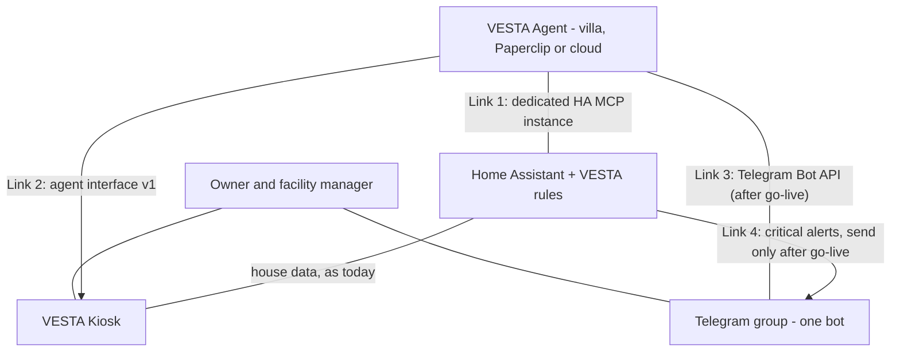

# VESTA Agent integration — technical preparation plan

Version 1.1 · 28 September 2026
Companion document: [`docs/agent-host/SPEC.md`](../agent-host/SPEC.md) (the HA app that hosts the VESTA Agent).

This plan prepares the **VESTA Kiosk** and **Home Assistant** so the **VESTA Agent** can be connected later with configuration only. It defines what our side exposes and changes. It does **not** define how the VESTA Agent is built, what its VESTA Skills contain, how it reasons, or where it runs.

---

## 1. Names

Use these names exactly. Never write "VESTA" alone.

| Name | Meaning |
|---|---|
| Home Assistant | The house system on the villa's HA Yellow: devices, history, automations, Telegram integration. |
| VESTA rules | The critical alert automations built from the `critical_*` blueprints. |
| VESTA Kiosk | App `villa_kiosk` (stable) and `villa_kiosk_dev2` (DEV2), repository `jim1982ha/villa-kiosk`: React/Babylon frontend + Python supervisor proxy (`rootfs/usr/bin/supervisor-proxy.py`). |
| Facility workspace | The VESTA Kiosk store `fm-data`: schedules, completions, costs, tickets, savedDocuments, plus evidence photos. |
| VESTA Agent | The AI agent built by Fabien on the Claude Agent SDK. Treated as an outside client wherever it runs. |
| VESTA Skills | The VESTA Agent's capabilities, changed without recoding it. |
| VESTA Agent host | The HA app that hosts the VESTA Agent on the HA Yellow (see SPEC.md). |
| HA MCP | The MCP server exposing Home Assistant to an AI agent. The VESTA Agent has its own instance, separate from the development one. |
| Telegram group | The single user channel, one bot. |

## 2. Architecture



| Link | Direction | Carries | Mechanism | Authentication |
|---|---|---|---|---|
| 1. Home Assistant | both | state changes, history, statistics, logbook, traces, HA and Supervisor logs; device control; `vesta_critical_event` | dedicated HA MCP instance on top of the HA REST/websocket API | "VESTA Agent" HA user token; Cloudflare Access + server secret when remote |
| 2. VESTA Kiosk | agent calls Kiosk | Facility records (read, create, update), messages/reports, choices, heartbeat | agent interface v1 (section 4) | `agent_token` bearer; Cloudflare Access service token when remote |
| 3. Telegram | both | all incoming messages and button presses; replies, reports, jobs | Telegram Bot API, existing bot | bot token held by the VESTA Agent after go-live |
| 4. HA → Telegram | send only | critical alerts | HA `telegram_bot`, send-only after go-live | existing |

## 3. Foundations (decided — do not change without the owner's approval)

- **F1** The VESTA Agent is an outside client. Nothing on our side may assume where it runs (HA Yellow app, Paperclip in Singapore, cloud).
- **F2** The VESTA Kiosk never calls the VESTA Agent. Every exchange is started by the VESTA Agent (pull model): the VESTA Kiosk needs no agent address.
- **F3** Home Assistant is the entrance to the house. The VESTA Agent reaches the VESTA Kiosk and Telegram directly.
- **F4** Critical detection belongs to the VESTA rules only. Each alert is also fired as `vesta_critical_event`, a signal the VESTA Agent may act on. The VESTA Agent never duplicates these rules.
- **F5** All other detection, actions, analytical reports and the facility-manager job flow belong to the VESTA Agent (VESTA Skills) — not to this plan.
- **F6** The VESTA Agent may read, create and update Facility records. Permanent deletion stays human-only. Every agent change is marked `source: "vesta_agent"`.
- **F7** One Telegram group, one bot. At go-live the VESTA Agent receives all updates; Home Assistant only sends critical alerts. Nothing changes in Telegram before go-live.
- **F8** Without the VESTA Agent, the VESTA Kiosk behaves exactly as today and the VESTA rules keep alerting, even offline.
- **F9** VESTA Kiosk locked constraints: Python stdlib + aiohttp only in the proxy, stores through `_json_store_handlers`, zero new frontend dependencies, `fmReport.ts` untouched.
- **F10** The VESTA Agent reaches Home Assistant only through its dedicated HA MCP instance with the "VESTA Agent" user. No local-only path (no direct Supervisor access, no config-folder mount, no SQLite file).

## 4. Workstream A — VESTA Kiosk (branch `dev2`)

### A1 Security baseline
Replace the placeholder `0000` passcodes (guest, owner, ops) before any agent path exists.

### A2 New options (`villa-kiosk/config.yaml`, schema + defaults)
| Option | Type | Default | Effect |
|---|---|---|---|
| `agent_token` | password, optional | empty | Empty: every `/agent/v1/*` route answers 404 and no agent UI is shown. Set: enables the agent role. |
| `agent_offline_after_minutes` | int(1,60) | 5 | Agent shown offline when no heartbeat within this window. |
| `agent_message_retention_days` | int(1,365) | 90 | Retention of agent messages and choices. |

### A3 Agent role in the proxy
- Add `"agent"` to `ROLE_CAPABILITIES` with new capabilities `agentRead`, `agentWrite`, `agentMessage`. It holds none of `administer`, `editConfig`, `manageModel`, `viewCameras`, and is refused on the HA relay routes (`/core/websocket`, `/core/api/*`).
- Auth: `Authorization: Bearer <agent_token>`, constant-time compare; wrong/missing → 401 and counts toward the existing lockout. Never a cookie, never on the profile picker.
- Keep `tests/proxy-rules.py` and `src/auth/permissions.ts` in agreement (the existing test enforces it).

### A4 Agent interface v1 (the VESTA Kiosk owns this contract)
All under `/agent/v1`, JSON, bearer token.

| Method and route | Purpose | Rules |
|---|---|---|
| `GET /agent/v1/info` | contract version (`1`), Kiosk version, capabilities | compatibility check |
| `GET /agent/v1/villa-model` | rooms, devices, entity ids, names, aliases, room of each device | read-only, derived from device-config |
| `GET /agent/v1/fm-data` | Facility workspace + revision | owner reader view |
| `PUT /agent/v1/fm-data` | create/update Facility records | existing fm-data factory: `rev` required (409 on conflict) + agent write guard (A5) |
| `POST /agent/v1/fm-evidence` | attach a photo | existing evidence checks and limits |
| `POST /agent/v1/messages` | publish message / report / recommendation | schema A6, returns id |
| `GET /agent/v1/choices?since=<seq>` | button presses made in the VESTA Kiosk | cursor, oldest first |
| `POST /agent/v1/heartbeat` | presence | updates last_seen; optional status text |

### A5 Agent write guard (Facility workspace)
- Any write that would remove an existing record from schedules, completions, costs, tickets or savedDocuments → 403 for the agent role. No elevation path for the agent.
- Every record created/changed by the agent carries `source: "vesta_agent"` (new optional field) and `updatedAt`; completions get `by: "VESTA Agent"`.
- `_fm_after_write` evidence clean-up unchanged (the agent cannot delete, so cannot orphan photos).

### A6 Message and choice stores
Two new whole-document stores via `_json_store_handlers` (revision checks included), pruned by `agent_message_retention_days`.

```json
{"message": {"id": "set by Kiosk", "kind": "message|report|recommendation",
  "title": "...", "body": "markdown", "severity": "info|warning|critical",
  "entities": ["light.living_room"], "buttons": [{"id": "approve", "label": "Approve"}],
  "allowed_profiles": ["owner", "ops"], "expires_at": "ISO|null",
  "created_at": "ISO", "state": "open|answered|expired"},
 "choice": {"seq": 42, "message_id": "...", "button_id": "approve", "profile": "owner", "at": "ISO"}}
```
- One choice per message: first press wins, later presses → 409, UI shows who answered.
- Expired messages keep content, hide buttons.

### A7 Presence
States: `not_configured` (no token), `offline` (no heartbeat within window), `online`. Last heartbeat persisted so a restart never shows a false "online".

### A8 User interface
| Element | Guest | Facility manager (ops) | Owner |
|---|---|---|---|
| Agent status indicator | hidden | shown | shown |
| Agent area (messages, reports) | hidden | shown | shown |
| Buttons on messages | hidden | if in `allowed_profiles` | if in `allowed_profiles` |
| "By VESTA Agent" marker on Facility records | hidden | shown | shown |

Everything absent when `not_configured`. When offline: area readable, buttons hidden, indicator says so. No new frontend dependency.

### A9 Test tool and tests
- `tests/agent-sim.py` (stdlib only) behaves like an agent: info, villa-model, fm-data read/update with rev, attempted deletion (must fail), message with buttons, choices, heartbeat. Runs against the internal address and through Cloudflare.
- `tests/proxy-rules.py`: agent capabilities, 401 without token, 404 when `agent_token` empty, refusal on `/core`, 403 on record removal, 409 on stale rev and on a second choice.

## 5. Workstream B — Home Assistant

### B1 Restore `vesta_critical_event` in `critical_condition`
- Add three `event:` actions (never `event.fire`), each **after** its notify step: `opened` after the alert, `resolved` after the all-clear, `abandoned` on the "Repeat after" timeout.
- Reuse the event blocks of `_archive/critical_condition.yaml`, adapted to the current actions. Changelog entry in the blueprint description (the only auditable changelog).
- **Never include `task_text`** — `vesta_task_actions` listens to this event and would create a job.

```json
{"blueprint": "critical_condition", "rule_id": "{{ this.entity_id }}",
 "incident_id": "{{ this.entity_id }}-{{ started }}", "phase": "opened|resolved|abandoned",
 "severity": "critical", "label": "{{ label }}", "entities": ["..."],
 "summary": "same text as the alert", "timestamp": "{{ now().isoformat() }}"}
```
- Verify by traces on all 7 instances (phase loss, phase overload, cabinet overheating, entrance unlocked, gate relay, laundry unlocked, master bedroom unlocked): alert AND event, for each phase.

### B2 Other `critical_*` blueprints (phase 2, one at a time)
| Blueprint | Live | Event |
|---|---|---|
| `critical_binary_trip` | 3 | opened, resolved |
| `critical_presence_guard` | 2 | opened, resolved |
| `critical_schedule` | 5 | one event type with a `reason` field for its four paths |
| `critical_watchdog` | 3 | opened only (mode parallel) |
| `critical_system` | 1 | opened, with disabled/missing automation lists |
| `critical_doorbell` | 1 | none |

### B3 Dedicated HA user "VESTA Agent"
Create now, login disabled; issue its long-lived token at go-live (or earlier for host self-tests). **Decide admin rights explicitly before go-live**: traces, HA logs and Supervisor logs need admin; HA has no read-only admin.

### B4 HA MCP instance for the VESTA Agent
Separate from the development instance, configured with the VESTA Agent token. Either inside the VESTA Agent host (sidecar, default) or a shared endpoint behind Cloudflare Access. Pin the server version (a past `mcp` SDK 2.0 change broke `mcp-proxy`). Tool restrictions are VESTA Agent side.

### B5 Recorder retention
Detailed history = recorder retention (default 10 days); long-term statistics kept indefinitely. Set retention to what VESTA Skills need, weighed against disk (5.0 GiB free on the Yellow).

### B6 Housekeeping
- Correct the `vesta_task_actions` description (it claims the add-on raises jobs; the VESTA Kiosk code does not).
- Free disk space and move backups off-device before installing the VESTA Agent host on the Yellow.

## 6. History and logs (Link 1)
| Data | Source in Home Assistant | Rights |
|---|---|---|
| State history | history queries | normal user |
| Long-term statistics | statistics queries | normal user |
| Logbook | logbook queries | normal user |
| Automation traces | trace queries | admin |
| HA error/system logs | system log, error log | admin |
| Supervisor, add-on, host logs | HA pass-through to the Supervisor | admin |

Optional (not baseline): direct SQL through a read-only user if the recorder moves to MariaDB/PostgreSQL. Reading the SQLite file is excluded.

## 7. Remote reachability
- Link 1: the VESTA Agent's HA MCP instance, through the Cloudflare tunnel when remote.
- Link 2: a Cloudflare tunnel route to the VESTA Kiosk limited to `/agent/v1/*`, protected by a Cloudflare Access service token, in addition to `agent_token`.
- No local-only webhook anywhere. `tests/agent-sim.py` must pass from outside the villa; a request without the Cloudflare service token must be refused.

## 8. Telegram switch-over (go-live only — not part of preparation)
| Step | Action | Check |
|---|---|---|
| 1 | VESTA Agent ready for the job flow (Done / Need help) and all messages | tested on a test group |
| 2 | HA `telegram_bot` → send-only | HA no longer receives updates |
| 3 | VESTA Agent host: `telegram_takeover: true` + bot token | messages and presses reach the agent |
| 4 | Turn off and retire `vesta_task_actions` | no duplicate handling |
| 5 | Trigger a test critical alert | still delivered by Home Assistant |
| Rollback | stop agent receiving, restore HA receiving, re-enable `vesta_task_actions` | HA handles job buttons again |

## 9. Acceptance criteria
| Area | Done when |
|---|---|
| No agent | `agent_token` empty → VESTA Kiosk identical to today. |
| Agent interface | `tests/agent-sim.py` passes every route, internally and through Cloudflare. |
| Records | Agent changes carry `source` and are marked in the UI; agent deletion refused. |
| Messages | Right profiles see buttons; one choice accepted; choice readable by the test tool. |
| Presence | online / offline / not configured correct, including after a Kiosk restart. |
| VESTA rules | 7 `critical_condition` instances alert as before and fire `vesta_critical_event` per phase. |
| Telegram | Unchanged until go-live. |

**Not decided here:** how the VESTA Agent is built, its VESTA Skills (what it does with each signal, how much it decides alone), where it runs, how it reasons.
